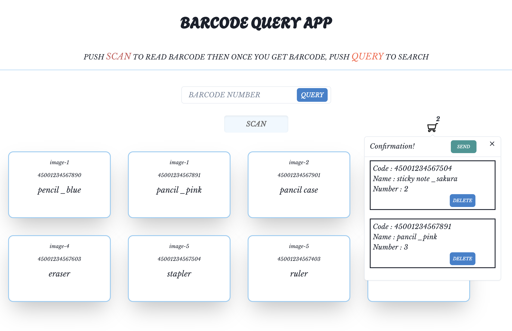

# BARCODE QUERY APP

仮想のECサイトをイメージして、バーコードから検索する機能、カート機能のDEMOを作成しました。

- Scanカメラでバーコードの読み取りができる
- バーコードを入力して商品一覧から検索がかけられる
- 商品をタップ、Scanカメラの検索でモーダルが表示
- 数を入力して追加するとカートに追加される
- 送信ボタンでDBにデータを送る（※未実装）



## Dependency

| 開発環境         | バージョン |
| ---------------- | ---------- |
| React            | ^18.2.0    |
| typescript       | ^5.2.2     |
| supabase         | ^2.38.5    |
| vite             | ^4.4.5     |
| msw              | ^1.0.0     |
| quagga2          | ^1.8.4     |
| eslint           | ^8.53.0    |
| prettier         | ^3.0.3     |
| chakra-ui        | ^2.8.1     |
| react-router-dom | ^6.20.0    |
| axios            | ^1.6.0     |
| recoil           | ^0.7.7     |

## Setup

```
npm install //初回のみ
npm run dev

http://localhost:5173/barcode でアクセスできる
※App.tsxでアドレス先を指定しています
```

バーコード一覧に表示させるデータの変更は、mockData.jsonを書き換える

```mock/data/mockData.json
[
  {
    "id": "uuid-1",
    "name": "pencil",
    "code": "45001234567890",
    "image": "image-1"
  },
  {
    "id": "uuid-2",
    "name": "notebook",
    "code": "45001234567901",
    "image": "image-2"
  },
  //ここに追加していく
]
```

## Usage

横幅1024px以上対応：

1. スキャン機能

- 「SCAN」ボタンクリックで、スキャンカメラが起動
- カメラでバーコード読み取りする
- バーコードが読み取れたらカメラ終了
- マスク部分をクリックで、カメラ終了

2. 検索機能

- テキストボックスにバーコードを入力
- 「QUERY」ボタンをクリック
- 一致するバーコードがあれば詳細モーダルが表示
- 一致するバーコードがなかったら全件表示

3. カート追加機能

- 各商品をホバーで、「DETAIL」が表示
- 各商品をクリックで、詳細モーダル表示
- 追加する個数を「number」のテキストボックスに記載（半角数字のみ）
- 「SEND」ボタンをクリックで、カートに追加。
- 右上のカートに数字が追加される

4. カート機能

- カートのアイコンをクリックで追加した商品一覧が表示
- 「DELETE」ボタンをクリックで追加した商品を削除
- 「SEND」ボタンクリックでDATABASEに追加するかどうかのダイアログ表示
- ※実際に追加する処理は未実装

## Authors

## References

## Note

- DB登録、送信は未実装です
- spabaseに登録部分についてはエラーになるのでコメントアウトしています
- mockData.jsonのバーコードはサンプルです。実際のバーコードとは関係ありません

## Design(mock)

- Figmaにてデザイン設計を行いました

https://github.com/aya030/barcodeQueryApp-React/assets/101713134/325e71e2-c401-4cd6-9c1f-6f2a1e28d006


## Design(dev)

- 動作確認用です

https://github.com/aya030/barcodeQueryApp-React/assets/101713134/3ce5d144-5bf0-4680-bc9f-6bfe9dd2523f


